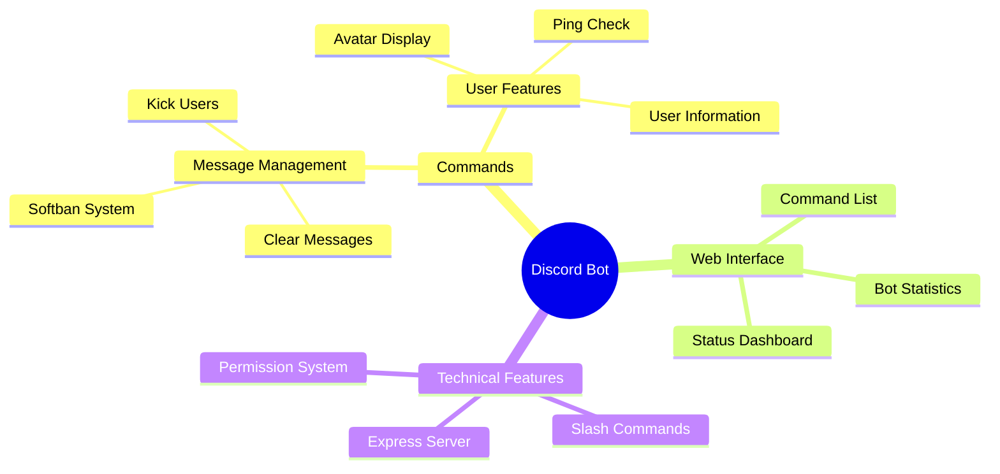

<div align="center">


<p align="center">
  <a href="#features">Features</a> •
  <a href="#demo">Demo</a> •
  <a href="#installation">Installation</a> •
  <a href="#tech-stack">Tech Stack</a>
</p>

[](LICENSE)
[](https://discord.js.org)
[](https://nodejs.org)
[](https://expressjs.com)

<p align="center">A powerful Discord bot built with Discord.js that provides essential server management features including message clearing and user information retrieval. Features a clean web interface for bot status monitoring. ✨</p>
</div>

## ✨ Features

<div align="center">



</div>

## 🎉 Invite to Server

<div align="center">
  
[](https://draven-bot.onrender.com/)

</div>

Click the button above to visit the bot's status page where you can add it to your Discord server. The status page also shows you all available commands and current bot statistics.

## 🛠️ Installation

1️⃣ Clone the repository:
```bash
https://github.com/lohitkolluri/Discord-Bot
```

2️⃣ Navigate to project directory:
```bash
cd Discord-Bot
```

3️⃣ Install dependencies:
```bash
npm install
```

4️⃣ Configure Environment:
- Create `.env` file with your Discord bot token
- Set up required permissions
- Configure port settings

5️⃣ Run the bot:
```bash
npm start
```

6️⃣ Access dashboard:
- Visit `http://localhost:3000`

## 💻 Tech Stack

<table align="center">
  <tr>
    <td align="center" width="96">
      
      <br>Discord.js
    </td>
    <td align="center" width="96">
      
      <br>Node.js
    </td>
    <td align="center" width="96">
      
      <br>Express
    </td>
    <td align="center" width="96">
      
      <br>JavaScript
    </td>
  </tr>
</table>

## ⚡ Core Features

- 🤖 Moderation Commands
  - `/clear` - Bulk delete up to 100 messages
  - `/kick` - Remove users from the server
  - `/softban` - Temporarily ban users with custom duration
- 👤 User Commands
  - `/userinfo` - Display detailed user information
  - `/avatar` - Show user's avatar in high resolution
  - `/ping` - Check bot's response latency
- 🎨 Web Interface
  - Real-time bot status monitoring
  - Interactive command list
  - Server statistics tracking
- 💻 Technical Features
  - Modern slash command system
  - Permission-based command access
  - Embedded rich message support

## 📄 License

<div align="center">

MIT License © [Lohit Kolluri](LICENSE)


</div>
